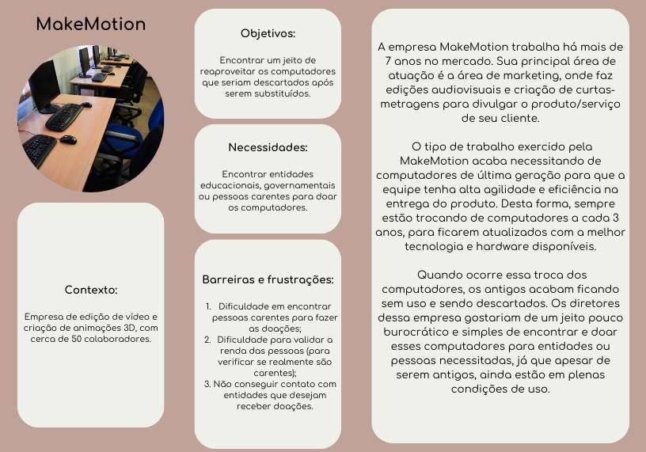
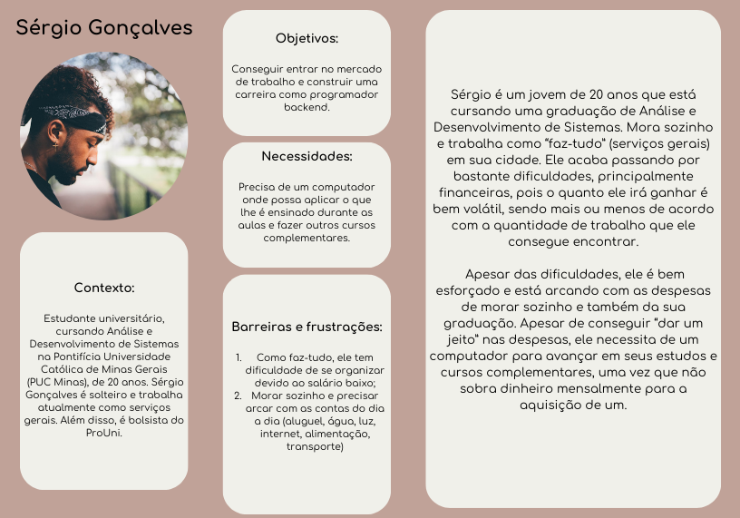
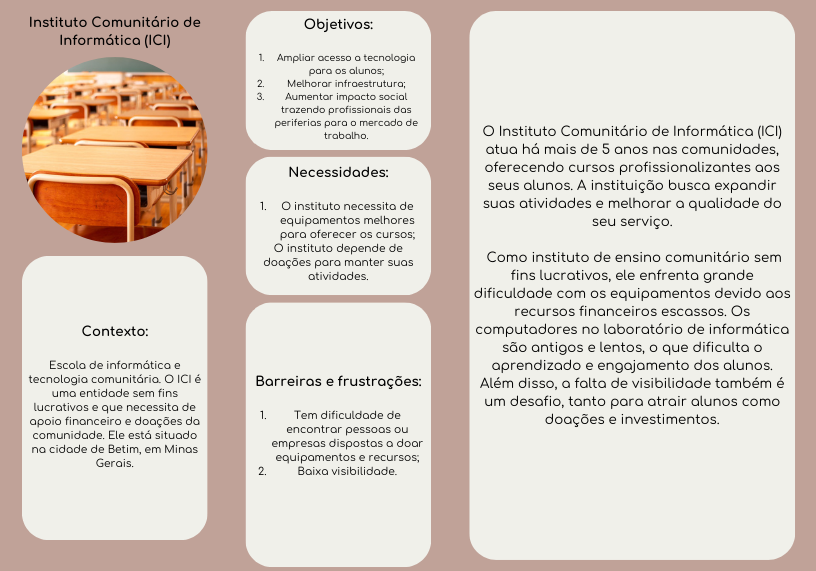
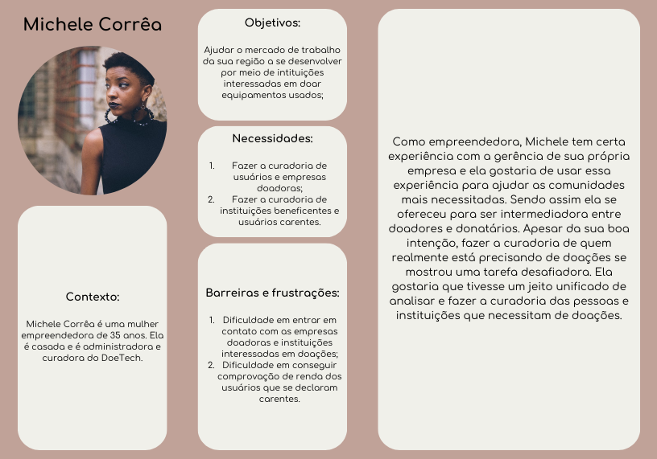
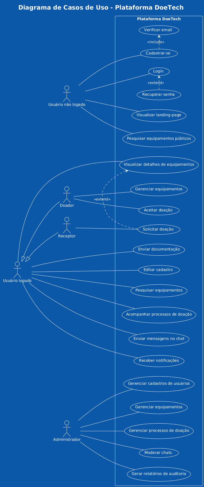

# Especificações do Projeto

Para a determinação das especificações do projeto, foram definidas personas que se encaixam nos atores descritos no público alvo. Junta-se a isso histórias de usuário, bem como os requisitos funcionais e não funcionais da aplicação.

## Personas

Foram criadas **4 personas**, numeradas de 1 a 4 (Figuras 1-4). Além disso, foram estabelecidos o contexto, os objetivos, as necessidades, as barreiras e as frustrações para cada uma das personas estabelecidas, como pode ser encontrado abaixo.

### Persona 1 - MakeMotion

A **MakeMotion** trabalha há mais de 7 anos no mercado. Sua principal área de atuação é na área de marketing, onde faz edições audiovisuais e criação de curtas-metragens para divulgar o produto/serviço do seu cliente. O tipo de trabalho exercido pela MakeMotion acaba necessitando de computadores de última geração para que a equipe tenha alta agilidade e eficiência na entrega do produto. Então sempre trocam todos os seus computadores a cada 3 anos, para ficarem atualizados com a melhor tecnologia e hardware disponíveis. Quando ocorre essa troca, os computadores antigos ficam sem uso, e a empresa acaba descartando-os como lixo eletrônico. Os diretores gostariam de um jeito pouco burocrático e simples de encontrar e doar esses computadores para entidades ou pessoas carentes, já que, apesar de serem antigos, ainda são excelentes.

* Contexto:
  * Empresa de edição de vídeo e criação de animações 3D;
  * Médio porte: cerca de 50 pessoas;
* Objetivos:
  * Encontrar uma forma de reaproveitar os computadores que seriam descartados após serem substituídos;
* Necessidades:
  * Encontrar entidades educacionais e sem fins lucrativos ou pessoas carentes para doar os computadores que seriam descartados;
* Barreiras e Frustrações:
  * Dificuldade em encontrar pessoas carentes para fazer as doações;
  * Dificuldade para validar renda das pessoas (para verificar se realmente são carentes);
  * Não conseguir contato com entidades interessadas.

 

Figura 1: persona 1 - empresa interessada em doar equipamentos eletrônicos.

### Persona 2 - Sérgio Gonçalves

**Sérgio Gonçalves** é um jovem de 20 anos que está cursando a graduação em Análise e Desenvolvimento de Sistemas na Pontifícia Universidade Católica de Minas Gerais (PUC Minas), e mora em Santana do Riacho, em Minas Gerais. Ele mora sozinho e trabalha como serviços gerais (faz-tudo) em sua cidade. Ele acaba passando por muitas dificuldades, principalmente financeiras, pois o quanto ele irá ganhar é bem volátil, sendo mais ou menos de acordo com a quantidade de trabalho que ele consegue encontrar. Apesar das dificuldades, ele é bem esforçado e está arcando com as despesas de morar sozinho e também da sua graduação. Apesar de estar conseguindo “dar um jeito” nas despesas, ele necessita de um computador para avançar em seus estudos e cursos complementares.

* Contexto: 
  * Idade: 20;
  * Solteiro;
  * Trabalha com serviços gerais (faz-tudo);
* Objetivos:
  * Conseguir entrar no mercado de trabalho e construir uma carreira como programador backend;
* Necessidades:
  * Precisa de um computador onde possa aplicar o que lhe é ensinado durante as aulas e fazer outros cursos complementares;
* Barreiras e Frustrações:
  * Como faz-tudo, ele tem dificuldade de se organizar devido ao salário baixo;
  * Morar sozinho e precisar arcar com as contas do dia a dia (aluguel, água, luz, internet, alimentação, transporte, etc).

 

Figura 2: persona 2 - jovem estudante carente que deseja receber um computador usado.

### Persona 3 - Instituto Comunitário de Informática (ICI)

O **Instituto Comunitário de Informática (ICI)** atua há mais de 5 anos em comunidades carentes, oferecendo cursos profissionalizantes aos seus alunos, na cidade de Betim, em Minas Gerais. A instituição busca expandir suas atividades e melhorar a qualidade do seu serviço. Como instituto de ensino comunitário sem fins lucrativos, eles enfrentam grande dificuldade com os equipamentos devido aos recursos financeiros escassos. Os computadores no laboratório de informática são antigos e lentos, o que dificulta o aprendizado e engajamento dos alunos. Além disso, a falta de visibilidade também é um desafio.

* Contexto:
  * Escola de informática comunitária;
  * Sem fins lucrativos;
* Objetivos:
  * Ampliar acesso a tecnologia para os alunos;
  * Melhorar a infraestrutura;
  * Aumentar impacto social trazendo profissionais das periferias para o mercado de trabalho;
* Necessidades:
  * O Instituto necessita de equipamentos melhores para oferecer os cursos;
  * O Instituto depende de doações para manter suas atividades;
* Barreiras e Frustrações:
  * Tem dificuldade de encontrar pessoas ou empresas dispostas a doar equipamentos e recursos;
  * Baixa visibilidade.

 

Figura 3: persona 3 - instituto comunitário sem fins lucrativos que demanda doações para funcionar.

### Persona 4 - Michele Corrêa

Como empreendedora, **Michele** tem certa experiência com a gerência de sua própria empresa e ela gostaria de usar essa experiência para ajudar as comunidades mais necessitadas. Sendo assim ela se ofereceu para ser intermediadora entre doadores e donatários. Apesar da sua boa intenção, fazer a curadoria de quem realmente está precisando de doações se mostrou uma tarefa desafiadora. Ela gostaria que tivesse um jeito unificado de analisar e fazer a curadoria das pessoas e instituições que necessitam de doações.

* Contexto:
  * Idade: 35;
  * Casada;
  * Empreendedora;
* Objetivos:
  * Ajudar o mercado de trabalho da sua região a se desenvolver por meio de intituições interessadas em doar equipamentos usados;
* Necessidades:
  * Fazer a curadoria de usuários e empresas doadoras;
  * Fazer a curadoria de instituições beneficentes e usuários carentes;
* Barreiras e Frustrações:
  * Dificuldade em entrar em contato com as empresas doadoras e intituições interessadas em doações;
  * Dificuldade em conseguir comprovação de renda dos usuários que se declaram carentes.

 

Figura 4: persona 4 - mulher empreendedora, que administra e faz a curadoria do DoeTech.

> Observação: Todas as figuras foram desenvolvidas pelos autores ou são livres de direitos autorais e permitem distribuição livre em modelo de domínio público.

## Histórias de Usuários

Com base na análise das personas foram identificadas as seguintes histórias de usuários:

| ID | EU COMO... `PERSONA`| QUERO/PRECISO... `FUNCIONALIDADE`| PARA... `MOTIVO/VALOR` |
|:--:|:--------------------|:---------------------------------|:-----------------------|
| HU-1 | **Usuário/empresa doadora** | Quero me cadastrar na plataforma como doador | Para que possa disponibilizar equipamentos da minha atividade/empresa que estejam sendo destinados à substituição ou descarte |
| HU-2 | **Usuário/empresa doadora** | Quero cadastrar os equipamentos que serão doados, informando detalhes técnicos (modelo, condição, especificações) e a origem dos equipamentos | Para que as instituições ou pessoas interessadas possam avaliar se o item atende às suas necessidades |
| HU-3 | **Usuário/empresa doadora** | Quero acompanhar o status da minha doação (ex.: pendente, em análise, aprovado, em transporte, entregue) | Para que eu tenha transparência sobre o destino dos equipamentos e possa planejar eventuais novas doações |
| HU-4 | **Usuário/empresa doadora** | Quero receber notificações quando um receptor se manifestar ou houver atualizações sobre a doação | Para que eu possa interagir rapidamente e esclarecer dúvidas ou combinar detalhes logísticos |
| HU-5 | **Instituição/pessoa de baixa renda** | Quero me cadastrar na plataforma e enviar a documentação necessária (comprovante de renda, cadastro único, etc.) | Para que meu perfil seja validado e eu possa ter acesso às doações disponíveis |
| HU-6 | **Instituição/pessoa de baixa renda** | Quero visualizar uma lista de equipamentos disponíveis (computadores, smartphones, etc.) com filtros por categoria e estado de conservação | Para que eu possa identificar quais itens atendem às minhas necessidades |
| HU-7 | **Instituição/pessoa de baixa renda** | Quero solicitar a doação de um equipamento selecionado que esteja em estoque | Para que eu possa receber o item e melhorar o acesso a recursos digitais e oportunidades educacionais |
| HU-8 | **Instituição/pessoa de baixa renda** | Quero acompanhar o status da minha solicitação (ex.: enviada, em análise, aprovada, em transporte, entregue) | Para que eu saiba quando esperar a chegada do equipamento e possa planejar sua utilização |
| HU-9 | **Instituição/pessoa de baixa renda** | Quero ter um canal de comunicação direto com o doador | Para que eu possa negociar detalhes da entrega ou esclarecer dúvidas sobre o equipamento |
| HU-10 | **Usuário administrador do DoeTech** | Quero revisar e validar os cadastros e documentos enviados pelos receptores | Para que a doação seja direcionada a quem realmente se enquadra nos critérios de elegibilidade |
| HU-11 | **Usuário administrador do DoeTech** | Quero monitorar todas as doações (listagens, solicitações, entregas) | Para que o processo seja transparente, bem organizado e eventuais problemas possam ser rapidamente identificados e solucionados |
| HU-12 | **Usuário administrador do DoeTech** | Quero intervir e mediar a comunicação entre doadores e receptores | Para que eventuais conflitos ou dúvidas sejam resolvidos de forma eficaz e o fluxo das doações não seja comprometido |

## Requisitos

As tabelas que se seguem apresentam os requisitos funcionais e não funcionais que detalham o escopo do projeto.

### Requisitos Funcionais

Tabela 1: Tabela de requisitos funcionais.

| ID     | Descrição do Requisito | Usuário | Prioridade |
|:------:|:----------------------:|:-------:|:----------:|
| RF-001 | Visualizar landing-page com informações institucionais, FAQs e iniciativas de sucesso | Não logado | ALTA |
| RF-002 | Pesquisar e visualizar equipamentos disponíveis para doação | Não logado | ALTA |
| RF-003 | Cadastrar-se como usuário (doador ou receptor) | Não logado | ALTA |
| RF-004 | Verificar email após cadastro | Não logado | ALTA |
| RF-005 | Autenticar-se no sistema | Não logado | ALTA |
| RF-006 | Recuperar senha | Não logado | ALTA |
| RF-007 | Enviar documentação para validação de cadastro | Logado | MÉDIA |
| RF-008 | Editar informações do próprio perfil | Doador/Receptor | ALTA |
| RF-009 | Cadastrar, editar e remover equipamentos para doação | Doador | ALTA |
| RF-010 | Aceitar solicitações de doação | Doador | ALTA |
| RF-011 | Solicitar doação de equipamentos cadastrados | Receptor | ALTA |
| RF-012 | Visualizar e filtrar cadastros de usuários não validados | Admin | ALTA |
| RF-013 | Visualizar documentos enviados pelos usuários | Admin | MÉDIA |
| RF-014 | Aprovar ou reprovar validação de cadastros de usuários | Admin | MÉDIA |
| RF-015 | Gerenciar equipamentos cadastrados para doação | Admin | ALTA |
| RF-016 | Gerenciar processos de doação | Admin | ALTA |
| RF-017 | Gerar relatórios de auditoria de doações por período | Admin | BAIXA |
| RF-018 | Gerar relatórios de usuários doadores e equipamentos doados | Admin | BAIXA |
| RF-019 | Gerar relatórios de usuários receptores e equipamentos recebidos | Admin | BAIXA |
| RF-020 | Acompanhar processos de doação através de timeline | Doador/Receptor | MÉDIA |
| RF-021 | Autorizar exibição de doações finalizadas como iniciativas de sucesso | Doador/Receptor | MÉDIA |
| RF-022 | Enviar mensagens no chat do processo de doação | Doador/Receptor | BAIXA |
| RF-023 | Receber notificações sobre atualizações em processos de doação e mensagens | Doador/Receptor | BAIXA |
| RF-024 | Receber notificações sobre solicitações de doação | Doador | BAIXA |
| RF-025 | Receber notificações sobre aceitação de solicitações | Receptor | BAIXA |
| RF-026 | Moderar chats de processos de doação (enviar/excluir mensagens) | Admin | BAIXA |

### Requisitos não Funcionais

Tabela 2: Tabela de requisitos não funcionais.

| ID     | Descrição do Requisito   |Prioridade |
|:------:|:-------------------------|:---------:|
|RNF-001| A aplicação deve ser performática | MÉDIA | 
|RNF-002| A aplicação deve adotar método transacional ao realizar alterações na base de dados para evitar estado não consistente | ALTA |
|RNF-003| A aplicação deve solicitar dados de renda e análise social aos receptores que se cadastram | ALTA |
|RNF-004| A aplicação deve ser desenvolvida em C# | ALTA |
|RNF-005| A aplicação deve permitir que o doador escolha se quer ou não compartilhar dados de contato com o receptor interessado | MÉDIA |
|RNF-006| A aplicação deve permitir que os administradores tenham acesso aos contatos de ambas as partes do processo de doação, em caso de processo iniciado | MÉDIA |
|RNF-007| A aplicação deve recusar equipamentos em mau estado de conservação/inservíveis | MÉDIA |
|RNF-008| A aplicação deve ser responsiva | MÉDIA |
|RNF-009| A aplicação deve exigir nome de usuário e senha para cadastro e login | ALTA |
|RNF-010| O nome de usuário deve ser o email do usuário | ALTA |
|RNF-011| A senha não deve ser armazenada na base de dados em texto puro, deve ser criptografada | MÉDIA |
|RNF-012| Deve-se utilizar base de dados relacional na aplicação | ALTA |
|RNF-013| Deve-se utilizar o SQL Server como base de dados | ALTA |

<!-- Com base nas Histórias de Usuário, enumere os requisitos da sua solução. Classifique esses requisitos em dois grupos:

- [Requisitos Funcionais
 (RF)](https://pt.wikipedia.org/wiki/Requisito_funcional):
 correspondem a uma funcionalidade que deve estar presente na
  plataforma (ex: cadastro de usuário).
- [Requisitos Não Funcionais
  (RNF)](https://pt.wikipedia.org/wiki/Requisito_n%C3%A3o_funcional):
  correspondem a uma característica técnica, seja de usabilidade,
  desempenho, confiabilidade, segurança ou outro (ex: suporte a
  dispositivos iOS e Android).
Lembre-se que cada requisito deve corresponder à uma e somente uma
característica alvo da sua solução. Além disso, certifique-se de que
todos os aspectos capturados nas Histórias de Usuário foram cobertos. -->

## Restrições

O projeto está restrito pelos itens apresentados na tabela a seguir.

Tabela 3: Tabela de restrições.
| ID | Restrição                                             |
|:--:|:------------------------------------------------------|
|R-01| O projeto deverá ser entregue até o final deste semestre |
|R-02| A aplicação backend deve ser desenvolvida em C# |
|R-03| SQL Server deve ser utilizado como base de dados em modelo relacional para a aplicação |

<!--
Enumere as restrições à sua solução. Lembre-se de que as restrições geralmente limitam a solução candidata.

 > **Links Úteis**:
> - [O que são Requisitos Funcionais e Requisitos Não Funcionais?](https://codificar.com.br/requisitos-funcionais-nao-funcionais/)
> - [O que são requisitos funcionais e requisitos não funcionais?](https://analisederequisitos.com.br/requisitos-funcionais-e-requisitos-nao-funcionais-o-que-sao/) -->

## Diagrama de Casos de Uso

O diagrama de casos de uso foi produzido com base nos requisitos levantados para a aplicação. Ele foi desenvolvido utilizando a ferramenta PlantUML, disponível [aqui](https://www.plantuml.com/plantuml/uml/ZLJDRXCn4BxxAORSWx9DcpQegbgrY4j15H3kK-zqTwHTUx6z2F7pC8W33u2uSCsBOMSTPnr2nINvnjyti_vcR5zQXyRrRIEUk9fQ0covGk7ODGGtZ9N15g4ak4QhRG0hgs4ATmqwVD36apUQtfAiXMZemO7JOBYg7PHiI3hMIWYKJXkOh6o__cPOWrf_rz3e2aiz0RImUdMxhydenDvelsOsYmFS4gz9KkSY5OD4NfKjAxREfEJDYX2hMpZ_Cft6MYbC-I8uG5Kr19E_3K_Wim3eBKcqNl2EROyDVq833QgILJNjiAB1mNKnbjwHVT-pzKho_nssf9osqAr_tpSijOqvH-ESQomnM31JIv6VPvydmmyiGyqMkOcIux7aLbUi8d4o9hpXlYFZSosf6hUV3tiUovwh3-mrfPPzs36kV_WvHl4Y4vRil50EMzvAJiUI5sH8ITvhGLIUFTAiNBdynmHASjZKP3qub5RCndbljEywkusrp5IHJUrAqa7HKIxIROUgzhhEQ4astfhzfFc1nhQaB5R-1vG6MQFRYe_tXaNtPBp6XO67ihye6GjpFTpdE8rXEtsyPYblyT_3AGxFyN6xsKHVwf8Ccet5L7MPLmsyeGRT-gVXeIRs9JjjE9tFcH0GhW4ylGX77Px1-JahsVGbNLm8299Yu4us77rqfCf85P4gPZdtLGZ_7C5q6hWTFDh1-GwUU764YuHE4recLCnsSBw3npleImtFq12VPP4_Os9ubT9A8SJc5OlX8ejEi-WiYvOf6dfuwNs7z_yF). O artefato construído pode ser encontrado abaixo (Figura 5).

Figura 5: Diagrama de casos de uso para o DoeTech.

> Observação: Todas as figuras foram desenvolvidas pelos autores ou são livres de direitos autorais e permitem distribuição livre em modelo de domínio público.

