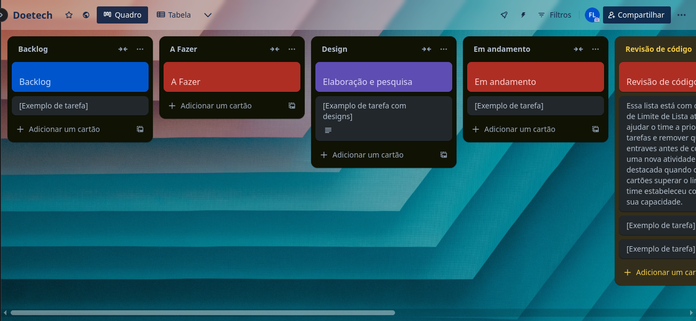

# Metodologia

A seguir, detalhes do ambiente de desenvolvimento e estrutura selecionados para o projeto.

## Ambiente de trabalho

Nesta seção, mais informações sobre o ambiente de desenvolvimento local para a aplicação, incluindo IDEs e demais ferramentas.

### Ambiente de desenvolvimento C#

Para o desenvolvimento da aplicação, foram selecionadas as seguintes IDEs (*Integrated Development Environment* - Ambientes de Desenvolvimento Integrado):

* [**Microsoft Visual Studio Community 2022**](https://visualstudio.microsoft.com/pt-br/), para uso no ambiente Windows;
* [**JetBrains Rider**](https://www.jetbrains.com/rider/) (versão 2024.3.5), para uso em ambientes Linux;

Visando proporcionar um ambiente **multiplataforma** para o desenvolvimento, foram selecionadas duas IDEs, permitindo o desenvolvimento em sistemas baseados em Windows e em sistemas Linux.

### Ambiente de desenvolvimento web

* [**Visual Studio Code**](https://visualstudio.microsoft.com/pt-br/#vscode-section) em sua última versão estável.

O Visual Studio Code será utilizado, principalmente, para o desenvolvimento da aplicação web, bem como construção de contratos [Swagger](https://swagger.io/).

### Docker: virtualizando dependências

Abaixo, como instalar o Docker localmente para executar as dependências da aplicação em ambiente virtualizado. Para ambientes Windows, deve ser instalado o Docker Desktop. Difererentemente da versão para Linux, o Docker Desktop instala, além da engine, uma interface gráfica para gerenciamento dos contêiners. Essa interface gráfica não está disponível para sistemas Linux.

#### Instalando em distribuições Linux

Em ambientes Linux baseados no Debian (como Ubuntu e Pop!_OS), o Docker deve ser instalado seguindo a documentação disponível [aqui](https://docs.docker.com/engine/install/). Além disso, pode ser instalado por meio dos repositórios oficias das distribuições (utilizando o `apt` como gestor de pacotes), utilizando:

```shell
sudo apt update
sudo apt install docker docker-compose
```

Para instalar em distribuições que utilizam o `dnf` como gestor de pacotes, como Fedora, CentOS, OpenSUSE, OpenMandriva, e Oracle Linux, use:

```shell
sudo dnf install docker-ce docker-ce-cli containerd.io docker-buildx-plugin docker-compose-plugin
```

#### Instalando no Windows

> :warning: Aviso! Ao utilizar o Docker no Windows, fique ciente da penalidade de desempenho observada na execução de contêiners frente à utilização em ambientes Unix-like, como Linux e macOS.

##### Instalar Docker Desktop

Em ambientes Windows, o Docker deve ser instalado seguindo a documentação disponível [aqui](https://docs.docker.com/desktop/). Essa versão inclui a engine do Docker e uma interface gráfica de gerenciamento dos contêiners. Essa interface não está presente em sistemas baseados em Linux.

##### Usar o Docker via Windows Subsystem for Linux (WSL2)

Você também pode instalar o Docker no ambiente WSL2 (Windows Subsystem for Linux 2). Para isso, você precisa seguir o tutorial de ativação e instalação do WSL, disponível [aqui](https://learn.microsoft.com/pt-br/windows/wsl/install). A seguir, acesse a loja do Windows e instale a última versão do `Ubuntu` (recomendação: versão 24.04 LTS). Após a instalação e um reinício, execute a ferramenta `Windows Terminal` e **encontre a opção de acessar o shell WSL da distribuição**. Caso tudo dê certo, você estará em um terminal executando o `bash`. A seguir, execute os passos de instalação do Docker em distribuições baseadas no Debian, como descrito na [seção anterior](#instalando-em-distribuições-linux).

### Base de dados e bucket S3

Para o projeto, o gerenciador de banco de dados selecionado foi o [**MySQL**](https://www.mysql.com/) versão 8.0. Para facilitar o desenvolvimento, também será utilizado o [**MySQL Workbench**](https://www.mysql.com/products/workbench/) para consultas e operações na base de dados.

Além da base de dados gerenciada (MySQL), o **Amazon S3** será utilizado para a **criação de buckets para a persistência de documentos em PDF** recebidos no processo de cadastro de usuários.

A base de dados e o bucket S3 serão utilizados na forma de um contêiner **Docker**, para facilitar testes de integração e desenvolvimento, além de padronizar a base entre os ambientes dos integrantes do projeto. Para tanto, para executar a base de dados e o bucket S3, utilizaremos o `docker-compose.yml` abaixo:

```yaml
version: '3.9'

services:
  mysql:
    image: mysql:8
    ports:
      - "3306:3306"
    environment:
      MYSQL_ROOT_PASSWORD: admin12345
      MYSQL_DATABASE: doetech
      MYSQL_PASSWORD: admin12345
    volumes:
      - mysql_data:/var/lib/mysql
    restart: unless-stopped
  
  localstack:
    container_name: "${LOCALSTACK_DOCKER_NAME:-localstack-main}"
    image: localstack/localstack
    ports:
      - "127.0.0.1:4566:4566"
      - "127.0.0.1:4510-4559:4510-4559"
    environment:
      - AWS_ACCESS_KEY_ID=root
      - AWS_SECRET_ACCESS_KEY=admin12345
      - AWS_DEFAULT_REGION=us-east-1
      - DEFAULT_REGION=us-east-1
      - EDGE_PORT=4566
      - LOCALSTACK_HOSTNAME="localhost"
      - DEBUG=1
      - SERVICES=s3
    networks:
      - doetech
    volumes:
      - "${LOCALSTACK_VOLUME_DIR:-./volume}:/var/lib/localstack"
      - "./.docker-compose/setup-localstack.sh:/etc/localstack/init/ready.d/setup-localstack.sh"
      - "/etc/localstack/init_ready/s3_startup.sh:/etc/localstack/init/ready.d/s3_startup.sh"
      - '/var/run/docker.sock:/var/run/docker.sock'
      - "./etc/localstack/init_ready/s3_startup.sh:/etc/localstack/init/ready.d/s3_startup.sh"
    restart: unless-stopped

networks:
  doetech:
    driver: bridge

volumes:
  mysql_data:
  localstack:
```

Além disso, é necessário criar o diretório `.docker-compose` no mesmo diretório onde está o arquivo `docker-compose.yml`. Neste diretório iremos adicionar scripts de inicialização do `localstack` para criar o bucket S3 necessário para persistir e recuperar arquivos. Após a criação do diretório, criar um arquivo nomeado `setup-localstack.sh` dentro dele (`.docker-compose`) com o conteúdo abaixo: 

```shell
awslocal s3api create-bucket --bucket doetech-docs
```

> Lembre-se de verificar os nomes de arquivos e diretórios. Erros de ortografia nos nomes vai impedir a configuração do `localstack` ou a execução dos contêiners. Veja que o diretório `.docker-compose` deve ter um ponto (.) antes do nome. Esse ponto indica, em sistemas Unix, que o arquivo ou diretório é oculto. A ausência do ponto inviabiliza a execução.

> Para ver arquivos ocultos (que começam com ponto final) no Linux, macOS, FreeBSD e outros ambientes Unix e Unix-like, utilize o comando `ls -a` no terminal ou configure o gerenciador de arquivos para exibir arquivos ocultos (no macOS isso exige configurações mais complexas via terminal). No Windows, arquivos e diretórios que comecem com . são exibidos normalmente.

Para executar o contêiner, basta acessar o diretório contendo o arquivo com o conteúdo acima e inserir, no terminal:

```shell
docker compose up
```

> No caso do Windows, utilizar o Docker Desktop para iniciar o contêiner, caso instalado.

> Caso instale o Docker em distribuições Linux utilizando o repositório oficial, a depender da versão, o comando de execução deve ser substituído para `docker-compose up`. Teste o comando padrão e, caso não encontrado, execute esta nova versão disponibilizada.

## Controle de Versão

A ferramenta de controle de versão adotada no projeto foi o
[Git](https://git-scm.com/), sendo que o [Github](https://github.com)
foi utilizado para hospedagem do repositório.

O projeto segue a seguinte convenção para o nome de branches:

- `main`: versão estável já testada do software
- `unstable`: versão já testada do software, porém instável
- `testing`: versão em testes do software
- `dev`: versão de desenvolvimento do software

Quanto à gerência de issues, o projeto adota a seguinte convenção para
etiquetas:

- `documentation`: melhorias ou acréscimos à documentação
- `bug`: uma funcionalidade encontra-se com problemas
- `enhancement`: uma funcionalidade precisa ser melhorada
- `feature`: uma nova funcionalidade precisa ser introduzida

## Gerenciamento de Projeto

A metodologia `Scrum` foi selecionada pois sua gestão de projetos ágil que tem como objetivo aumentar a produtividade e a qualidade do trabalho desenvolvido. Ela é baseada em três pilares: **transparência**, **inspeção** e **adaptação**.

### Divisão de Papéis

A equipe utiliza o Scrum como base para definição do processo de desenvolvimento.

- **Scrum Master**: Felipe Miguel Nery Lunkes;
- **Product Owner**: João Paulo Fernandes Salviano;
- **Arquiteto de software**: Felipe Miguel Nery Lunkes;
- **Equipe de Desenvolvimento**:
  - Diovane Marcelino Azevedo;
  - Felipe Miguel Nery Lunkes;
  - João Paulo Fernandes Salviano;
  - Verônica Hoffmann Fernandes Adler.

### Processo

O gerenciamento do projeto e do fluxo de desenvolvimento se dará pela ferramenta [**Trello**](https://trello.com/b/VjVBXnYw/doetech). No board do Trello, temos três colunas principais, com as funções à seguir:

* `Backlog`: nesta coluna estão as tarefas do backlog do projeto. Elas serão priorizadas e enviadas para a coluna `A fazer` quando puderem ser desenvolvidas;
* `A fazer`: nesta coluna estarão os cards com as tarefas que devem ser implementadas, por ordem de priorização. Quando mais acima na listagem, mais prioritária. Cada integrante do projeto deve pegar o próximo card assim que concluir o anterior e o próximo card não tiver nenhuma pendência descrita;
* `Design`: nesta coluna estarão os cards já com desenvolvedor responsável que estiverem na fase de design da implementação. Esta coluna pode ser utilizada quando for necessário desmembrar uma tarefa em subtarefas ou quando se quiser realizar a discussão dos requisitos ou ideias de implementação;
* `Em andamento`: nesta coluna ficam as tarefas que estão em desenvolvimento ativo por algum integrante do time. Caso alguma dúvida surja durante o desenvolvimento ou a tarefa precise ser temporariamente pausada, deve-se criar um comentário informando o motivo do bloqueio;
* `Revisão de código`: assim que a implementação estiver concluída, mover o card para esta coluna para review do código pelos pares.
* `Fase de testes`: após o review, as tarefas implementadas devem ser testadas para verificar se atendem aos requisitos propostos. A seguir, o código, documentação ou artefato podem ser incluídos no ramo principal dos componentes do projeto;
* `Conluído`: nesta coluna estão os cards concluídos da Sprint.

<div align="center">



Figura 1: Board do DoeTech no Trello.

</div>

### Ferramentas

Para o desenvolvimento do projeto, foram selecionadas as seguintes ferramentas/softwares:

* **IDEs**:
  - Microsoft Visual Studio Community 2022 (Windows);
  - JetBrains Rider (Linux);
* **Editor de código**:
  - Visual Studio Code, com extensões de suporte à JavaScript/TypeScript;
* **Base de dados** (gerenciador de banco de dados):
  - MySQL;
* **Ambiente de virtualização**:
  - Docker;
* **Comunicação entre o time**: 
  - Microsoft Teams (comunicação síncrona);
  - Discord (comunicação assíncrona);
  - WhatsApp (comunicação assíncrona);
* **Ferramenta de design de fluxos**:
  - [draw.io](https://draw.io);
  - Figma;
* **Gerenciamento do projeto**:
  * Trello.

#### Justificativa de escolha das feramentas

* **IDEs**: o **Microsoft Visual Studio Community 2022** foi escolhido por ser a IDE padrão para o desenvolvimento na linguagem C#, além de ter uso gratuito. Entretanto, por ser limitado ao ambiente Windows, a IDE **JetBrains Rider** também foi selecionada, uma vez que é gratuita para uso acadêmico, é totalmente compatível com o Visual Studio (incluindo atalhos) e pode ser utilizada em ambientes Windows, Linux e macOS;
* **Editor de código**: O **Visual Studio Code** é gratuito, bastante usado e recomendado por desenvolvedores pela facilidade de uso, suporte à extensões e integração com git, terminal e outras ferramentas que facilitam o desenvolvimento;
* **Base de dados**: o gerenciador de banco de dados relacional, **MySQL**, é estável e muito utilizada em ambiente de produção, além de ser . Além disso, é gratuita e tem fácil virtualização via Docker. O **MySQL Workbench** é gratuito e tem versões para Windows, Linux e macOS. O **Amazon S3** foi escolhido por ser uma base de dados (bucket) orientada a arquivos muito útil para armazenar e recuperar arquivos binários como PDFs e imagens. Localmente, a **AWS** fornece o **localstack** para uso do S3 via contêiner Docker.
* **Ambiente de virtualização**: o Docker foi selecionado pois permite a virtualização, em contêiner, de dependências da aplicação, como a base de dados. Isso permite uma padronização nas configurações e ambiente, além de permitir a execução de testes de integração sem afetar o ambiente local;
* **Comunicação entre o time**: O **Microsoft Teams** foi escolhido para os encontros síncronos por permitir gravação, registro e controle de comentários e mensagens. Já o **Discord** e **WhatsApp** foram selecionados para comunicação asssíncrona por permitirem facilidade de uso;
* **Ferramenta de design de fluxos**: O **draw.io** é uma ferramenta poderosa de design de fluxos, bastante usada por desenvolvedores. Já o **Figma** é uma ferramenta padrão para a modelagem de interfaces, sendo fácil e gratuita;
* **Gerenciamento do projeto**: o **Trello** foi selecionado por ser gratuito e simples de se utilizar, além de ser mais poderoso e apresentar mais funções que ferramentas como o GitHub Projects.