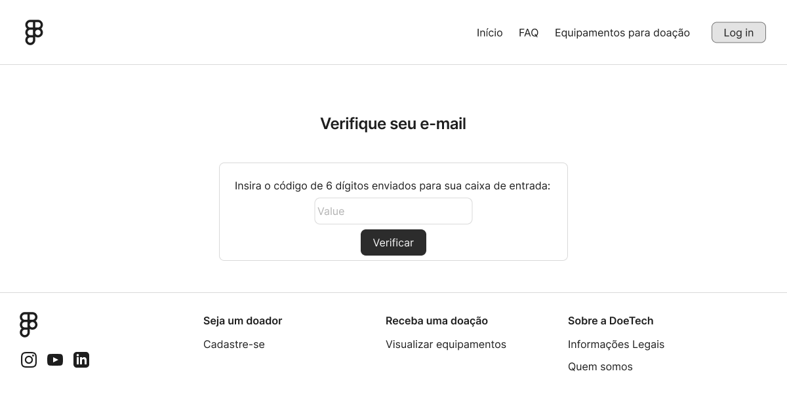

# Projeto de Interface

Neste projeto, optamos por uma abordagem mais pragmática para a criação de wireframes, utilizando elementos pré-construídos do Figma em vez dos tradicionais esboços de baixa fidelidade que se assemelham a rabiscos. Esta decisão metodológica foi tomada considerando que o objetivo principal dos wireframes é comunicar efetivamente a estrutura e funcionalidade das interfaces, não apenas seu aspecto visual rudimentar.

A utilização de componentes básicos do Figma proporciona um equilíbrio ideal entre baixa fidelidade conceitual e representação prática dos elementos HTML que efetivamente comporão a interface. Esta abordagem permite discussões mais produtivas com os atores do projeto, pois apresenta uma visualização mais próxima dos padrões web reconhecíveis pelos usuários, sem, contudo, desviar o foco para decisões finais de design como tipografia, cores ou estilos específicos.

Além disso, esta metodologia otimiza o tempo de desenvolvimento ao permitir a rápida prototipação e iteração das interfaces, mantendo o foco nas questões estruturais e funcionais, enquanto já estabelece algumas diretrizes básicas de layout que facilitarão a transição para o design de alta fidelidade nas etapas posteriores do projeto.

## Diagrama de Fluxo

O diagrama que apresenta o estudo do fluxo de interação do usuário com o sistema interativo pode ser encontrado abaixo (figura 1).

Figura 1: diagrama de fluxo

## Wireframes

### Interface para usuários não logados

  <h4>Home</h4> 

  <h4>Sobre</h4> 

  <h4>FAQ</h4> 

  <h4>Pesquisar equipamentos</h4> 

  <h4>Cadastro</h4> 

  <h4>Verificação de email</h4> 

  <h4>Recuperação de senha</h4> 

  <h4>Recuperação de senha 1</h4> 

  <h4>Recuperação de senha 2</h4> 

  <h4>Login</h4> 

---

### Interface para usuários logados, mas ainda não validados

  <h4>Usuário logado e não verificado</h4> 

  <h4>Documentação sob análise</h4> 

  <h4>Documentação aprovada</h4> 

  <h4>Documentação reprovada</h4> 

---

### Interface para usuários validados

  <h4>Painel do usuário logado</h4> 

  <h4>Editar detalhes do seu usuário</h4> 

  <h4>Doações em andamento</h4> 

  <h4>Detalhes da doação (Donatário)</h4> 

  <h4>Detalhes da doação (Doador, Administrador)</h4> 

  <h4>Chat</h4> 

  <h4>Lista equipamentos do usuário para doação (Doador)</h4> 

  <h4>Cadastrar equipamento (Doador)</h4> 

  <h4>Editar / remover equipamento (Doador)</h4> 

  <h4>Pesquisar equipamentos</h4> 

  <h4>Detalhes e solicitação do equipamento</h4> 

  <h4>Confirma solicitação do equipamento</h4> 

---

### Interface para usuário administrador

  <h4>Painel do administrador</h4> 

  <h4>Gerar relatórios</h4> 

  <h4>Doações em andamento</h4> 

  <h4>Detalhes da doação</h4> 

  <h4>Chat moderação</h4> 

  <h4>Gerenciar equipamentos</h4> 

  <h4>Detalhes e remoção do equipamento</h4> 

  <h4>Gerenciar usuários</h4> 

  <h4>Detalhes e remoção do usuário</h4> 

  <h4>Visualizaçaõ de documentos</h4> 

---

O projeto Figma pode ser encontrado para visualização [aqui](https://www.figma.com/design/WQfUtKiYBoFTv4pfi8cpj1/Wireframes---DoeTech?node-id=2-8895&t=HA9NrKBqKG5z5pyy-0).

### Considerações Finais sobre o Design de Interface

O conjunto de interfaces apresentado neste documento reflete uma abordagem centrada no usuário, com fluxos claramente segmentados por perfil de acesso e funcionalidades. A estrutura hierárquica das telas foi planejada para garantir que os usuários possam navegar intuitivamente pelo sistema, encontrando com facilidade as funcionalidades relevantes para seu perfil específico.

As interfaces foram projetadas considerando também aspectos de acessibilidade digital, com elementos de navegação consistentes e uma estrutura que facilita tanto a implementação técnica quanto a adaptação para diferentes dispositivos. Os wireframes apresentados servirão como base sólida para o desenvolvimento das interfaces de alta fidelidade e, posteriormente, para a implementação do front-end da plataforma.

À medida que o projeto avançar para as próximas fases, estes wireframes serão refinados com base em testes de usabilidade e feedback dos usuários, garantindo que a solução final atenda plenamente às expectativas e necessidades dos diferentes perfis de usuários da plataforma DoeTech.
 
<!--
> **Links Úteis**:
> - [Protótipos vs Wireframes](https://www.nngroup.com/videos/prototypes-vs-wireframes-ux-projects/)
> - [Ferramentas de Wireframes](https://rockcontent.com/blog/wireframes/)
> - [MarvelApp](https://marvelapp.com/developers/documentation/tutorials/)
> - [Figma](https://www.figma.com/)
> - [Adobe XD](https://www.adobe.com/br/products/xd.html#scroll)
> - [Axure](https://www.axure.com/edu) (Licença Educacional)
> - [InvisionApp](https://www.invisionapp.com/) (Licença Educacional)

-->
