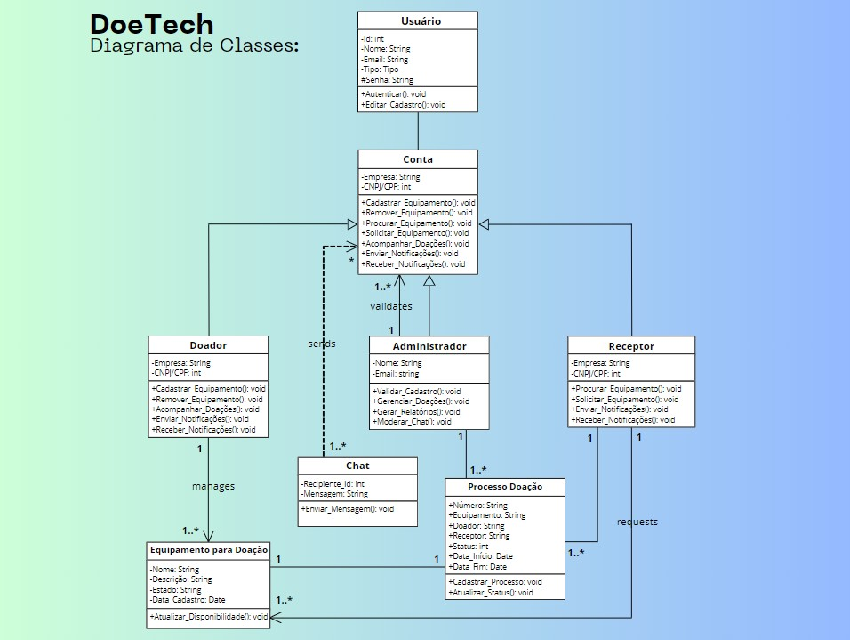
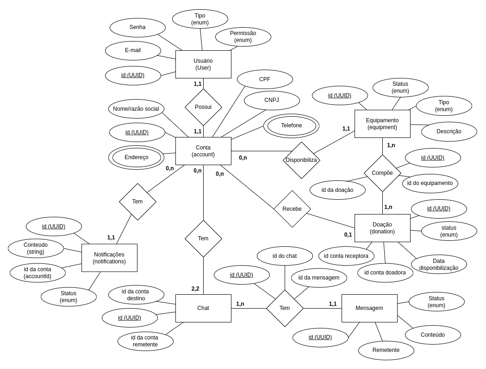
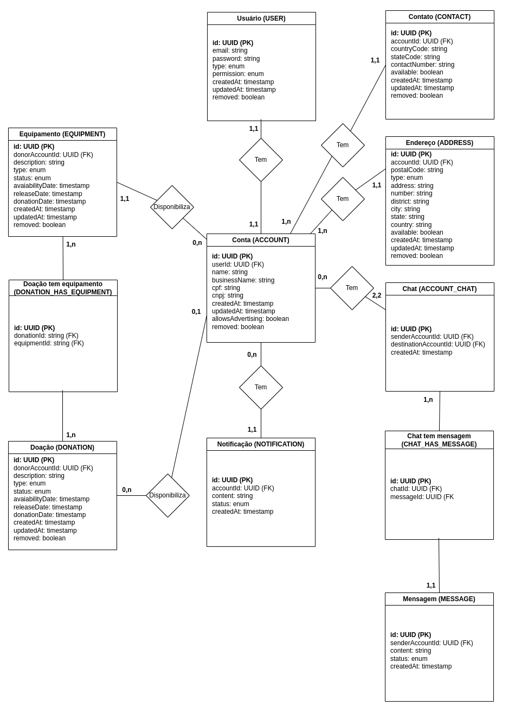
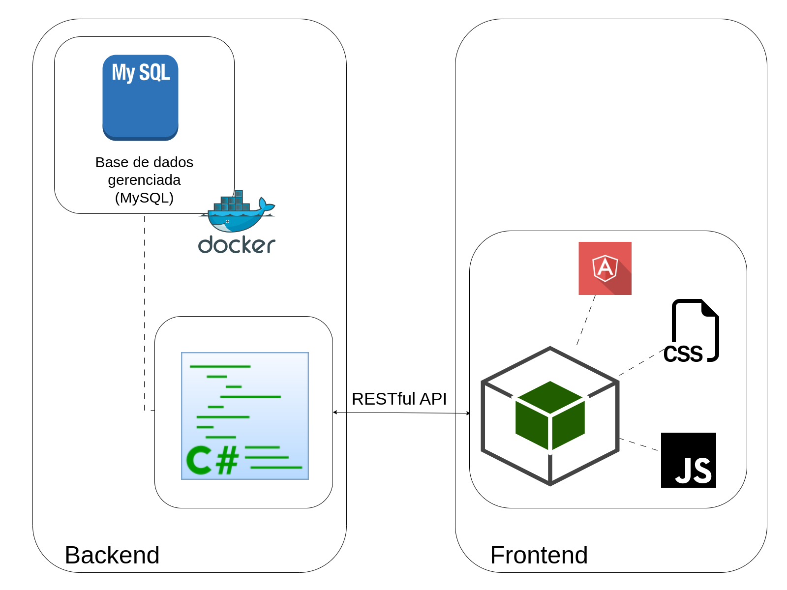

# Arquitetura da Solução

## Diagrama de Classes

O diagrama de classes (figura 1) ilustra graficamente como será a estrutura do software, e como cada uma das classes da sua estrutura estarão interligadas. Essas classes servem de modelo para materializar os objetos que executarão na memória.

Figura 1: Diagrama de classes.

## Modelo ER (Projeto Conceitual)

O Modelo Entidade-Relacionamento (figura 2) representa através de um diagrama como as entidades (coisas, objetos) se relacionam entre si na aplicação interativa.

Figura 2: Modelo entidade relacionamento.

## Projeto da Base de Dados

O projeto da base de dados (figura 3) corresponde à representação das entidades e relacionamentos identificadas no Modelo ER, no formato de tabelas, com colunas e chaves primárias/estrangeiras necessárias para representar corretamente as restrições de integridade.
 

Figura 3: Projeto da base de dados da aplicação, com as tabelas e seus relacionamentos.

## Tecnologias Utilizadas

A arquitetura da aplicação (figura 4) foi modelada para utilizar as seguintes tecnologias:

### Backend

Para o backend, a aplicação utiliza:

#### Linguagem de programação e frameworks da implementação

A implementação utiliza a **linguagem C#** (versão 9.0), junto aos frameworks (pacotes NuGet) que se seguem:

* **Microsoft.EntityFrameworkCore.Design** - Entity Manager Core (versão 9.0.3);
* **Microsoft.AspNetCore.Mvc.NewtonsoftJson** (versão 9.0.3);
* **Microsoft.Extensions.Configuration.Abstractions** (versão 9.0.3);
* **Microsoft.AspNet.WebApi.Versioning** (versão 5.1.0);
* **Microsoft.AspNetCore.Mvc.Core** (versão 2.3.0);
* **Microsoft.AspNetCore.Mvc.Versioning** (versão 5.1.0);
* **Newtonsoft.Json** (versão 13.0.3);
* **Pomelo.EntityFrameworkCore.MySql** (versão 9.0.0);
* **Azure.Storage.Blobs** (versão 12.24.1).

> Vale ressaltar que cada pacote também implementa suas próprias dependências.

#### *Integrated Development Environment* (IDE)

Foram selecionadas e validadas duas IDEs para o desenvolvimento. O **Visual Studio Community 2022** foi selecionado para o desenvolvimento em ambiente Windows, enquanto uma IDE totalmente compatível, **JetBrains Rider** (versão 2024.3.5), foi selecionada para o desenvolvimento em ambientes Linux. O **Visual Studio Code** foi selecionado para permitir a criação e edição de documentação e contratos Swagger. Para mais informações, leia mais sobre a justificativa de escolha de cada IDE [aqui](./03-Metodologia.md#justificativa-de-escolha-das-feramentas).

#### Docker

O **Docker** foi selecionado para virtualizar as dependências da aplicação, como a base de dados (MySQL), por exemplo. Isso permite uma uniformidade entre as máquinas de todos os desenvolvedores e a hospedagem do serviço, além de permitir testes de integração que sejam seguros, não interferindo na base de dados de teste e produção. Tenha mais informações sobre a utilização do Docker no projeto [aqui](./03-Metodologia.md#docker-virtualizando-dependências), bem como a [justificativa](./03-Metodologia.md#justificativa-de-escolha-das-feramentas) de escolha da ferramenta.

#### Base de dados

O **MySQL** foi selecionado como gerenciador de banco de dados relacional para persistir os dados na aplicação.

Além da base de dados geranciada (MySQL), também utilizaremos o **Amazon S3** para persistir e recuperar arquivos binários, como PDFs e imagens.

#### Azure Storage Blobs

O **Azure Storage Blobs** foi utilizado para armazenar imagens de perfil de usuários e equipamentos, bem como documentos em formato PDF. Para mais informações sobre o serviço, clique [aqui](https://azure.microsoft.com/pt-br/products/storage/blobs).

### Frontend

#### Linguagem de programação e frameworks da implementação

O frontend da aplicação será desenvolvido em **JavaScript/TypeScript** utilizando o framework **Angular**. Também será utilizado o framework **Bootstrap** (CSS).

#### *Integrated Development Environment* (IDE)

Para o desenvolvimento, foi selecionado o **Visual Studio Code** como IDE.

## Comunicação entre os componentes

A **integração** entre o **backend** e o **frontend** se dá por meio de **endpoints RESTful** disponibilizados pelo backend. Para mais informações sobre os endpoints disponibilizados, bem como os *inputs* e *outputs* esperados, leia o **contrato Swagger** disponível [aqui](./contrato.yml).

## Diagrama da arquitetura da aplicação

A seguir, o diagrama da arquitetura pensada para a aplicação, com todos os componentes separados em domínios (figura 4).

Figura 4: Diagrama da arquitetura da aplicação, evidenciando os principais componentes do backend e do frontend da aplicação interativa.

## Hospedagem

As aplicações web backend e frontend estão hospedadas ns serviço Azure, da Microsoft. Para acessar a aplicação frontend, clique [aqui](https://ambitious-desert-0ad52340f.6.azurestaticapps.net). Para testes locais, utilize o [arquivo](../src/DoeTech/Postman.json) `Postman.json`, disponível no diretório da aplicação backend, como contrato.

