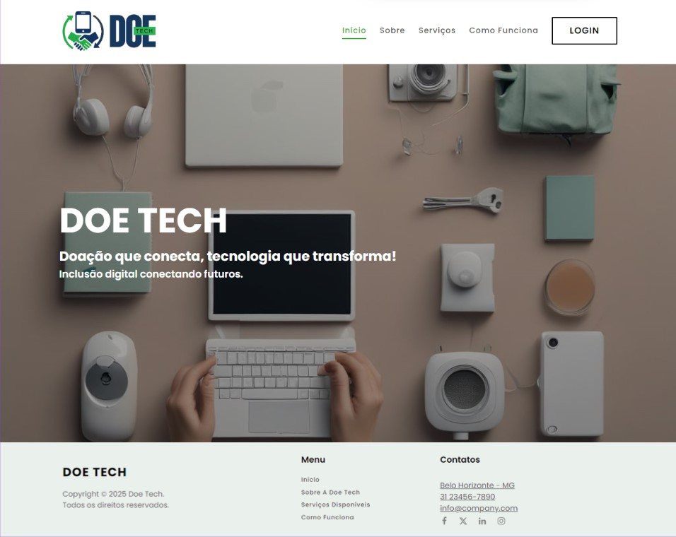
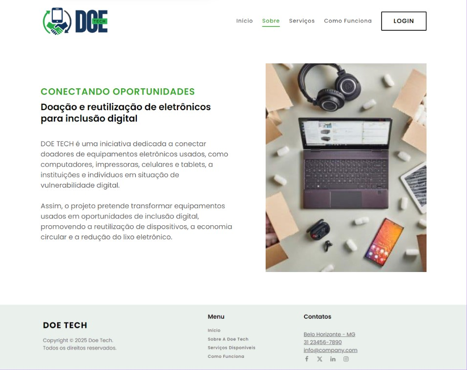
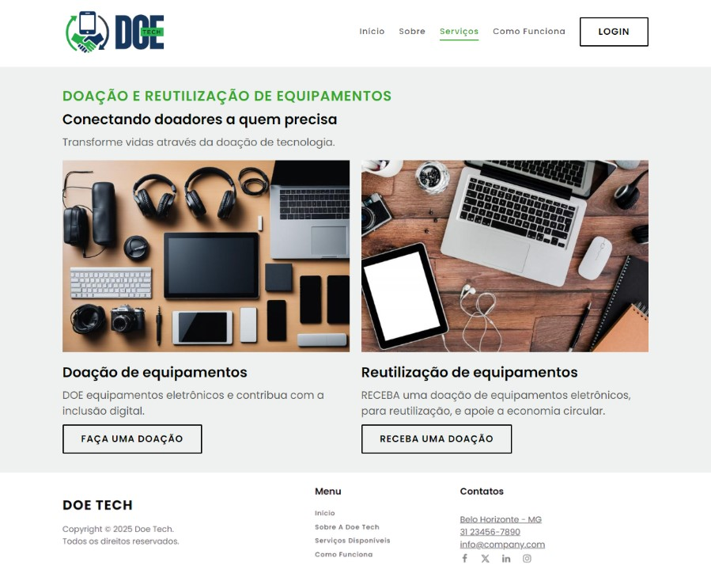
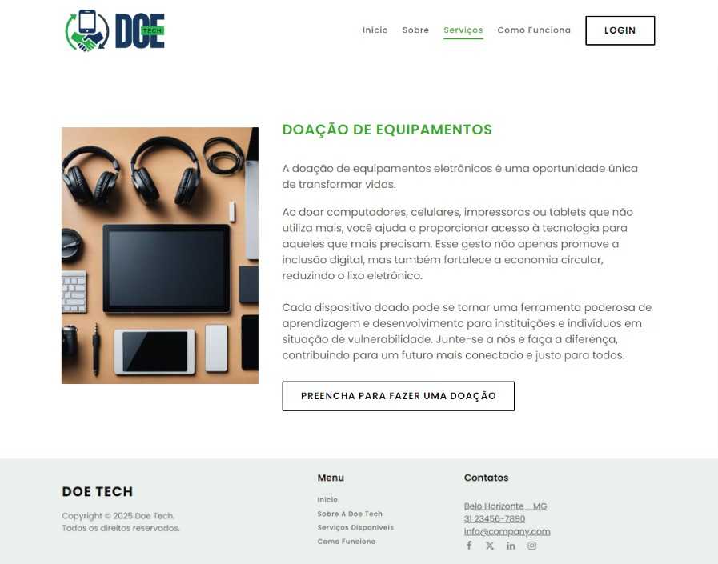
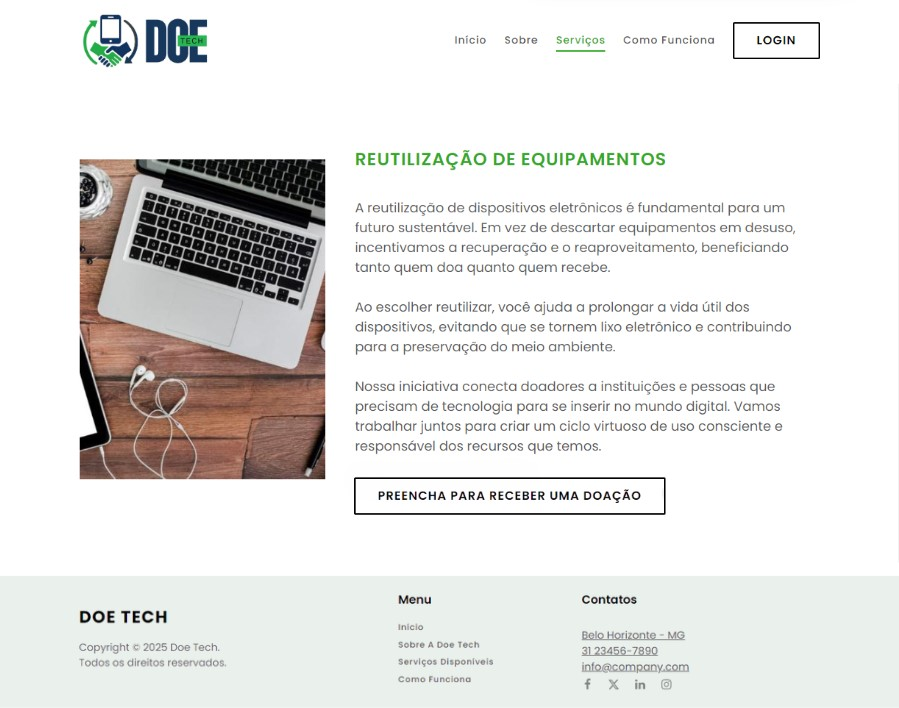
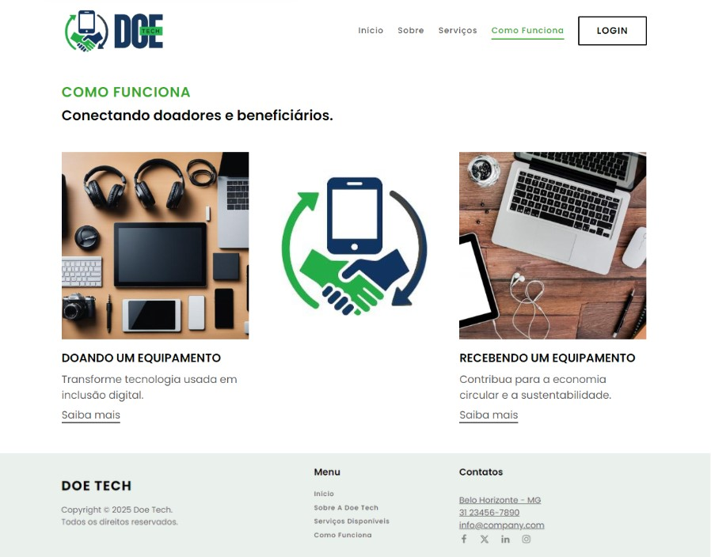
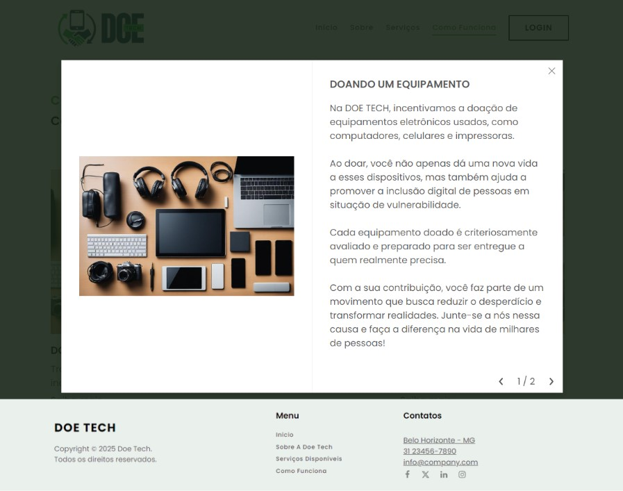
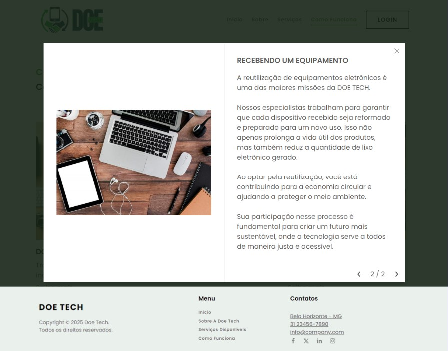
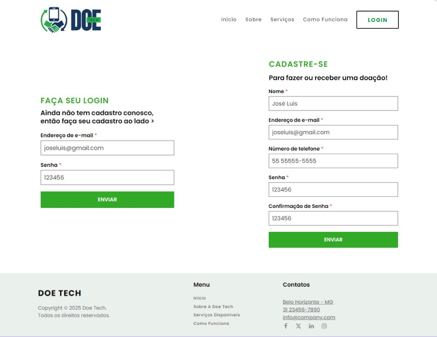

# Template padrão da Aplicação

Layout padrão do site (HTML e CSS), utilizado em todas as páginas com a definição de identidade visual, aspectos de responsividade e iconografia.
As páginas apresentam como elementos padrão o menu de navegação, cabeçalho, rodapé e os elementos visuais citados abaixo:

### Identidade visual (elementos visuais)

#### Cores:
  
  * **Primárias**: RGB #18375d, #29b554;
  * **Secundárias**: RGB #EEF1EF, #32AA27;
  * **Escala de Cinza**: RGB #020402, #595959;
  * **Branco**: RGB #FFFFFF.

#### Família de fontes (font-family):
  
  **Poppins**

#### Tamanho das fontes (font-size):

##### HeadLine
  * **Título**: POPPINS BOLD - 3,875 REM;
  * **Subtítulo**: Poppins - 1,5 rem.

##### Body

  * **H1**: POPPINS BOLD - 1,5 REM;
  * **H2**: Poppins Bold - 1,5 rem;
  * **H3**: Poppins Bold - 1,25 rem;
  * **H4**: Poppins Bold - 1,125 rem;
  * **H5**: Poppins Bold - 1 rem;
  * **Parágrafo**: Poppins Regular - 1,125 rem;
  * **Parágrafo pequeno**: Poppins Regular - 1 rem;
  * **Link**: Poppins Regular - 1,125 rem;
  * **Link secundário**: Poppins Regular - 1 rem.

##### Caption

Poppins Regular: 1,125 rem. 

##### Navigation

  * **N1**: POPPINS BOLD: 1,65 rem;
  * **N2**: Poppins Bold: 0,875 rem;
  * **N3**: Poppins Bold: 0,725 rem.

## Interface da aplicação

### Tela inicial (home page)

Exibe tela inicial da aplicação, composta por cabeçalho com logo, menu e botão login/cadastro, e ainda imagem de fundo com nome da aplicação, slogan e subtítulo. Tudo isso complementado pelo rodapé com nome da aplicação, menu e informações de contato.

<figcaption>Figura 1 - Tela inicial</figcaption>

### Tela Sobre

Exibe tela sobre a aplicação, composta por cabeçalho com logo, menu e botão login/cadastro, e principalmente informações sobre a aplicação, seus objetivos e missão. Tudo isso complementado pelo rodapé com nome da aplicação, menu e informações de contato.

<figcaption>Figura 2 - Tela Sobre</figcaption>

### Tela Serviços

Exibe tela com os serviços da aplicação, composta por cabeçalho com logo, menu e botão login/cadastro, e ainda indicação dos serviços da aplicação, com título e subtítulos, e uma descrição breve de cada serviço da aplicação, com botão CTA, sob imagens ilustrativas. Tudo isso complementado pelo rodapé com nome da aplicação, menu e informações de contato.

<figcaption>Figura 3 - Tela Serviços</figcaption>

### Tela Serviços - Doação

Exibe tela com o serviço de doação da aplicação, composta por cabeçalho com logo, menu e botão login/cadastro, e ainda um convite ao serviço de doação da aplicação, com título, texto explicativo e convidativo para o serviço de doação, com botão CTA, ao lado de imagem ilustrativa. Tudo isso complementado pelo rodapé com nome da aplicação, menu e informações de contato.

<figcaption>Figura 4 - Tela Serviços - Doação</figcaption>

### Tela Serviços - Receber doação

Exibe tela com o serviço de receber doação da aplicação, composta por cabeçalho com logo, menu e botão login/cadastro, e ainda um convite à prática de reutilização proposta pela aplicação, com título, texto explicativo e convidativo para o serviço de receber doação, com botão CTA, ao lado de imagem ilustrativa. Tudo isso complementado pelo rodapé com nome da aplicação, menu e informações de contato.

<figcaption>Figura 5 - Tela Serviços - Receber doação</figcaption>

### Tela Como Funciona

Exibe tela sobre como funciona a aplicação, com os serviços e o ícone da aplicação, composta por cabeçalho com logo, menu e botão login/cadastro, e ainda indicação dos serviços da aplicação, com título e subtítulo, e uma chamada para cada serviço da aplicação, com link "Saiba mais", sob imagens ilustrativas. Tudo isso complementado pelo rodapé com nome da aplicação, menu e informações de contato.

<figcaption>Figura 6 - Tela Como Funciona</figcaption>

### Tela Box "Saiba mais" Doando

Exibe tela que aparece quando o usuário clica em "Saiba mais" no serviço de doação na tela Como Funciona. Essa tela apresenta um box com título e um texto explicativo sobre como funciona o processo de doação da aplicação, ao lado de imagem ilustrativa. A tela Como Funciona permanece atrás do box com um filtro para que não interfira na visualiação e leitura do box.

<figcaption>Figura 7 - Tela Box "Saiba mais" Doando</figcaption>

### Tela Box "Saiba mais" Recebendo Doação

Exibe tela que aparece quando o usuário clica em "Saiba mais" no serviço de receber doação na tela Como Funciona. Essa tela apresenta um box com título e um texto explicativo sobre como funciona o processo de receber doação da aplicação, ao lado de imagem ilustrativa. A tela Como Funciona permanece atrás do box com um filtro para que não interfira na visualiação e leitura do box.

<figcaption>Figura 8 - Tela Box "Saiba mais" Recebendo Doação</figcaption>

### Tela de Login/cadastro

Na tela de login/cadastro, composta por cabeçalho com logo, menu e botão login/cadastro, temos dois formulários: um formulário de login para usuários já cadastrados incluírem email e senha e entrarem na aplicação, e outro formulário de cadastro para usuários novos se cadastrarem na aplicação, incluindo seus dados pessoais, como nome, email, telefone de contato e senha de acesso. Tudo isso complementado pelo rodapé com nome da aplicação, menu e informações de contato.

<figcaption>Figura 9 - Tela de Login/cadastro</figcaption>

## Iconografia

A criação do logotipo da aplicação levou em consideração o aspecto da doação e da reciclagem, bem como um ícone de dispositivo eletrônico, mostrando a proposta do projeto, usando as cores #18375d (Azul escuro) e #29b554 (Verde médio).

 <figcaption>Figura 10 - Logo Doe Tech</figcaption>

